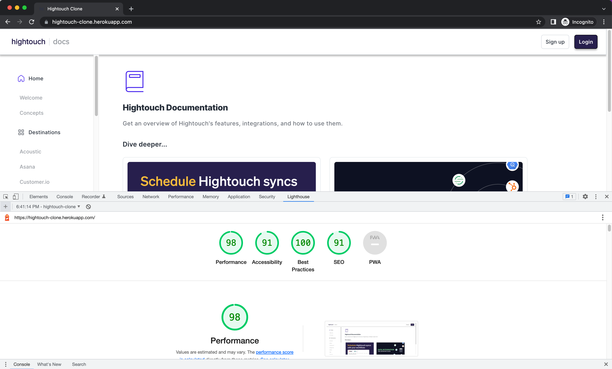

# Hightouch Clone

Implement a minimal design of the Hightouch’s documentation website.

## Goals

+ Technical
  * Implement using React
  * Incorporate any other libraries (e.g. styled-components)
+ Design
  * The implementation should follow the Figma mock closely.
  * Make improvements to the design where you see fit.
+ Top bar
  * Login and Signup buttons should have a hover state
Sidebar navigation
  * The content should come from a JSON object that is easy for a non-technical person to edit and add new items to.
  * Navigation items should have a hover state and active state
Actual navigation between pages is not required
+ Main content
  * Dive deeper cards should have a hover state
+ Responsiveness
  * The site should switch between Desktop and Mobile views
  * Mobile should be displayed if screen width is below 800px

## Wireframes

* [Figma](https://www.figma.com/file/TEl4aPk6a29pRzYcE3gFK2/Frontend-Interview
)

## Building and Running Environment

First install dependencies:

```sh
npm install
```

To create a development build:

```sh
npm run build-dev
```

To run node server:

```sh
npm run start-dev
```

## Tech Stack
* [React](https://reactjs.org)
* [Node](https://nodejs.org/en)
* [Express](http://expressjs.com)

## Demo


## Running

Open [Hightouch Clone](https://hightouch-clone.herokuapp.com) in the browser.

## Lighthouse Score



## Future Implementations

* Nested routing
* Signup and Login page
* Document pages
